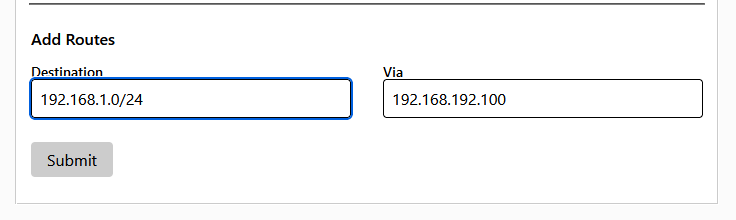

# proxmox zerotier router setup
Scripts to setup zerotier (as router) in an LXC container on Proxmox 6.5 (and maybe higher). 

You will need an existing zerotier network (and the id). 
After creation auth the client and set up a managed route to your network as shown here: [Zerotier Docs](https://zerotier.atlassian.net/wiki/spaces/SD/pages/224395274/Route+between+ZeroTier+and+Physical+Networks)

The `Via` field needs to have the assigned IP of the client in your network. 
The `Destination` field needs to have your local networks IP (with the last segment being 0), followed by `/24`.



Use this command to interactively create the container: 
```
bash -c "$(curl -s https://raw.githubusercontent.com/schattenphoenix/zerotier-setup/main/setup.sh)"
```

Please read the files before using. I am not responsible for any damages caused!